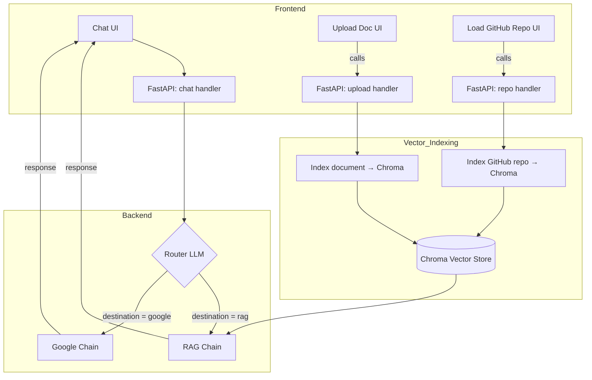

# RAG + Google‑Search Chat Agent for reading papers with code

A Retrieval‑Augmented Generation (RAG) system powered with Google Search to read papers that have code implementations. The system allows for direct chat with the content of a paper and a repository associated with it, making it possible to locate the implementation of ideas described in a paper directly.

The original code for a production-ready RAG system was taken from this [tutorial](https://blog.futuresmart.ai/building-a-production-ready-rag-chatbot-with-fastapi-and-langchain) by the great Pradip Nichite. This system was capable of:

1. Ingesting PDFs, DOCXs, and HTMLs into a Chroma vector store.  
2. Answer via an LLM using a RAG over indexed documents (history‑aware).
3. Expose a clean REST API (FastAPI) and interactive frontend (Streamlit).

With that as a starting point, I added the following features:
 1. Automatic Github repository cloning and indexing by just providing the link  
 2. Live Google Search (history‑aware) automatically routed per‑query. 

## Full list of features

- **Multi‑Tenant Document Indexing**
  - Upload PDFs, DOCXs, HTML files
  - Index GitHub repos (Python code)
  - Vector embeddings in Chroma

- **Hybrid QA Agent**
  - **RAG Chain**
    - History‑aware retriever with `create_history_aware_retriever`
    - Prompts to contextualize follow‑ups
    - Uses `gpt-4.1-nano` or `gpt-4o-mini`
  - **Google‑Search Chain**
    - LLM‑reformulated search queries
    - Wraps `GoogleSearchAPIWrapper` as a Tool
    - History‑aware prompt for external info

- **Dynamic Routing**  
  - LLM router that returns `{"destination": "rag"}` or `{"destination": "google"}` based on the user query
  - Built on LangChain’s `StateGraph` (node graph)

- **Full Chat History**  
  - Persisted per session in DB
  - Fed into both RAG and Google chains

- **Production‑Grade API**  
  - FastAPI endpoints for uploading, listing, and deleting docs
  - `/chat` endpoint returns `answer`, `session_id`, `model`, and `source` ("rag" or "google")

## Architecture of main functionality


## Quickstart
### Clone the repo
```bash
git clone https://github.com/josedavid220/paper-with-code-rag.git
```

### Configure env variables

1. Copy the example file:
```bash
cp .env.example .env
```
2. Configure the keys for OpenAI, Google Custom Search API, and LangChain.

```
OPENAI_API_KEY=""
LANGCHAIN_TRACING_V2=true
LANGCHAIN_API_KEY=""
LANGCHAIN_PROJECT=""
LANGSMITH_ENDPOINT=""
GOOGLE_API_KEY=""
GOOGLE_CSE_ID=""
```

### Launch the front and backend
For the backend (for production mode change `dev` for `run`):
```bash
fastapi dev api/main.py
```

For the frontend:
```bash
streamlit run app\streamlit_app.py
```

## Demo
[https://youtu.be/R2AsqRWxnRs](https://youtu.be/R2AsqRWxnRs)


## Things to add/improve
 - 
 - Add support for more models. Currently, only OpenAI models are selectable.
 - Update to a Graph RAG system to create knowledge bases for each paper.
 - Improve the prompt that handles the orchestration of agent actions.
 - Add agent tool/route in charge exclusively of code generation.
 - Create a section for a list of links to the papers referenced.
 - When a section of code is retrieved, indicate the file where it can be found.
 - Experiment with different chunk sizes.
 - Use Agentic Character Splitting instead of Recursive Character Splitting, as described [here](https://github.com/FullStackRetrieval-com/RetrievalTutorials/blob/main/tutorials/LevelsOfTextSplitting/5_Levels_Of_Text_Splitting.ipynb). This could have an important impact on pricing.
 - Manage persistent memory after refreshing the page.
 - Add support for other languages other than Python.